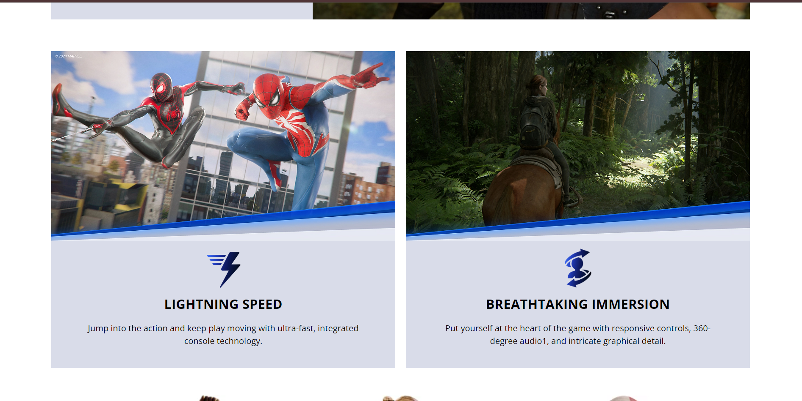

# PlayStation 5 Website

This is a sample website showcasing the PlayStation 5. It is intended for demonstrating basic web development skills and is **responsive for mobile devices**. It does not include advanced features.

## Overview

This project provides a sample showcase of the PlayStation 5 console, featuring a simple, static webpage. It is designed for practice purposes and aims to help learn and apply HTML, CSS, and JavaScript.

## Preview

Below are the previews of the website:





> **Note:** The images above provide a visual overview of different sections of the sample website.

## How to Run the Website

1. Clone the repository:
   ```sh
   git clone https://github.com/SHAHUL-AHMED-77/Ps5-Website.git
   ```

2. Navigate to the project directory:
   ```sh
   cd Ps5-Website
   ```

3. Open the `index.html` file in your browser to view the website.

## Educational Purpose Only

This project is created **for educational purposes only**. It is a non-commercial sample website intended solely for learning and personal practice. The content is used for demonstration purposes, without any affiliation with or endorsement by Sony Interactive Entertainment.
